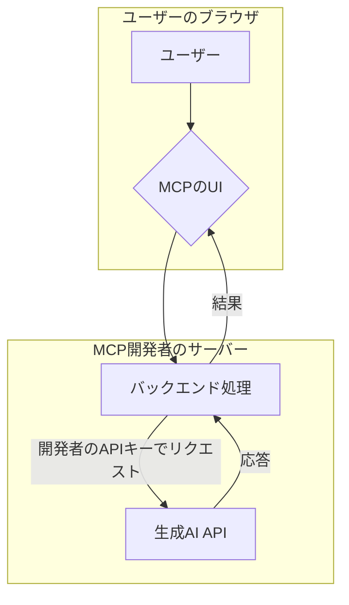
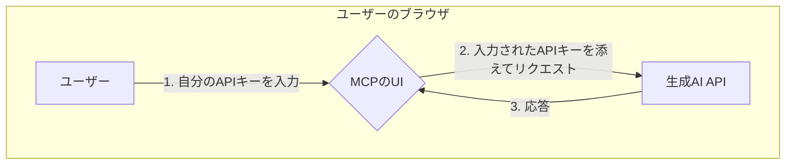

# 【比較】MCP公開時のAPI利用料の支払いモデル

MCP（Model-Customized Persona）を公開した際のAPI利用料の支払いモデルについて解説します。主に2つのモデルが存在します。

### 1. 通常のモデル（開発者が支払う）

WebサイトやサービスにMCPを組み込む際、そのMCPが内部で呼び出す生成AIのAPIキーは、開発者自身のものがプログラムのコードやサーバーの設定に含まれています。

*   **仕組み**:
    1.  ユーザーがWeb上のMCPを利用します。
    2.  MCPのサーバー（バックエンド）は、**開発者があらかじめ設定しておいたAPIキー**を使って、生成AI（例: OpenAIのAPI）にリクエストを送ります。
    3.  利用料金は、そのAPIキーの発行元である開発者のアカウントに請求されます。

この方法は、ユーザーがAPIキーを持っていなくても手軽にMCPを試せるという利点がありますが、人気が出ると開発者の負担が大きくなるという課題があります。

### 2. MCPサーバーモデル（ユーザーが支払う）

「MCPをサーバーとして提供し、ユーザーがAPI利用料を支払う」というのは、ユーザー自身のAPIキーを使ってもらう仕組みを構築する、ということです。

*   **仕組み**:
    1.  ユーザーは、利用したい生成AIサービス（例: OpenAI）で**自分自身のAPIキー**を取得します。
    2.  MCPのWebサイトやアプリケーション上で、そのAPIキーを入力・設定する場所が提供されています。
    3.  MCPは、**ユーザーが入力したAPIキー**を使って生成AIにリクエストを送ります。
    4.  結果として、利用料金はAPIキーの持ち主であるユーザーのアカウントに請求されます。

このモデルでは、開発者はAPI利用料を負担する必要がなくなります。その代わり、ユーザーにAPIキーを取得して設定してもらうという手間が発生します。多くのPC向けAIアプリケーションでこの方式が採用されています。

### 2つのモデルの比較

以下に、2つのモデルの処理の流れを簡単な図で示します。

**モデル1：開発者支払い**

**モデル2：ユーザー支払い**

（※この図は、ユーザーのブラウザから直接APIを呼び出すシンプルな例です）

このように、誰のAPIキーを使うかによって、料金の負担者が変わる仕組みになっています。ご自身のMCPをどのように提供したいかに合わせて、適切なモデルを選択することが重要です。 

参考情報
[[【調査】uvxによるMCPサーバーの簡単な構築方法]]