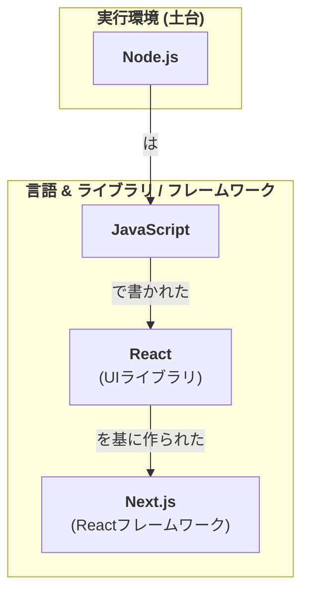

# 【比較】node.jsとnext.jsの違い

## Node.jsとNext.jsの概要

**Node.js** は、サーバーサイドでJavaScriptを実行するための環境です。本来ブラウザでしか動作しないJavaScriptを、サーバー側で動かせるようにしたもので、WebサーバーやAPIの構築など、主にバックエンド開発に用いられます。

**Next.js** は、ReactをベースにしたWebアプリケーションを構築するためのフレームワークです。サーバーサイドレンダリング（SSR）や静的サイト生成（SSG）といったモダンなWeb開発に必要な機能が予め組み込まれており、効率的に高機能なフロントエンドを開発できます。

## 特性の比較

| 項目 | Node.js | Next.js |
| :--- | :--- | :--- |
| **分類** | JavaScript実行環境 | Reactフレームワーク |
| **主な用途** | バックエンド開発（Webサーバー、API、CLIツールなど） | フロントエンド開発（Webサイト、Webアプリケーション） |
| **立ち位置** | 基盤となる環境 | アプリケーションを構築するための骨組み |
| **抽象度** | 低レベル（HTTPサーバーなど基本的な機能を提供） | 高レベル（ルーティング、レンダリング手法など多くの機能が組み込み済み） |

## 関係性

Next.jsはNode.jsの環境上で動作します。つまり、Next.jsで開発されたアプリケーションを実行するためには、Node.jsがインストールされている必要があります。

## まとめ

-   **Node.js**は「JavaScriptをサーバーで動かすための土台」です。
-   **Next.js**は「Node.jsという土台の上で、React製の高機能なWebサイトを効率よく作るための道具セット」です。

料理に例えるなら、Node.jsが「ガスコンロや調理器具」といったキッチンのインフラで、Next.jsは「特定の料理（例：フランス料理）を作るためのレシピと、それに特化した調理器具のセット」と考えることができます。

両者は競合するものではなく、Next.jsがNode.jsを利用する、という補完関係にあります。

## 補足：Vue.jsの場合
ご質問の通り、Vue.jsもNode.jsと同様の関係性にあります。

ReactにとってのNext.jsのように、Vue.jsには**Nuxt.js**という代表的なフレームワークが存在します。Nuxt.jsもサーバーサイドレンダリングなどの機能を提供し、その実行にはNode.jsが必要です。

- **Node.js**: 実行環境（土台）
- **Vue.js**: UIを構築するためのライブラリ
- **Nuxt.js**: Node.js上で動作する、Vue.jsベースのフレームワーク

このように、Vue.jsでの開発においてもNode.jsは土台として利用されており、「Node.jsの上でVue.js（やNuxt.js）が動く」というイメージは正しいです。

### 補足：Next.jsとNuxt.jsの違い
`Next.js`と`Nuxt.js`は名前が似ていますが、それぞれ異なるライブラリを基盤とする**別のフレームワーク**です。記載間違いではありません。

-   **Next.js**: **React** をベースにしたフレームワーク
-   **Nuxt.js**: **Vue.js** をベースにしたフレームワーク

両者はそれぞれのライブラリ（ReactとVue.js）で高機能なWebアプリケーションを効率的に開発するという共通の目的を持っているため、「ReactにとってのNext.js」、「Vue.jsにとってのNuxt.js」という対比で語られることが多くあります。

## 図解

