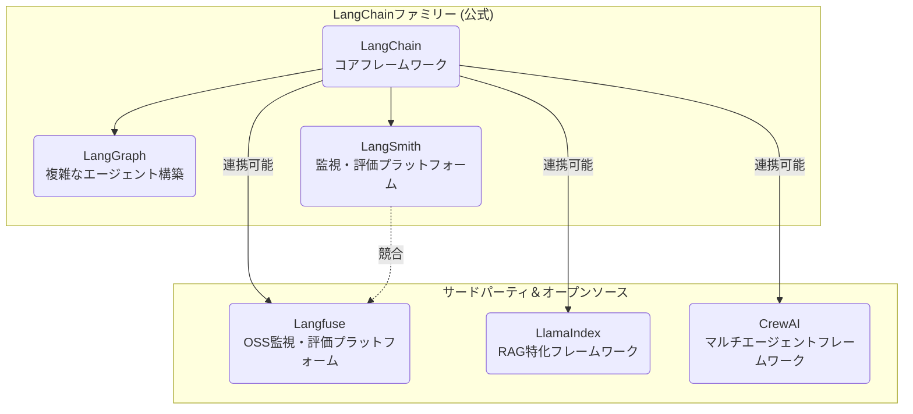

# LangChain関連ツールの関係性と比較

## はじめに

LangChain、Langfuse、LangSmith、LangGraphなどのツールは、大規模言語モデル（LLM）を用いたアプリケーション開発を効率化し、その運用を支援するためのものです。この記事では、これらのツールの関係性、それぞれの特徴、そしてどのような場合にどのツールを選択すべきかを解説します。

## 全体の関係図

中心となるのは開発フレームワークである `LangChain` で、他のツールはそれを拡張したり、開発したアプリケーションの監視・評価を行ったりする役割を担います。



## 各ツールの概要

### 1. LangChainファミリー（公式）

LangChain社が開発・提供しているツール群です。

- **LangChain**:
  LLMアプリケーション開発の**中核となるフレームワーク**です。データソースとの連携、処理の連鎖（Chain）、自律的なエージェント機能など、開発に必要な基本機能を提供します。多くのLLM関連ツールのエコシステムの中心に位置します。

- **LangGraph**:
  `LangChain`を拡張し、**グラフ構造を用いて複雑なエージェントやワークフローを構築**するためのライブラリです。複数のエージェントが協調したり、処理がループしたりするような、より高度な制御が可能になります。

- **LangSmith**:
  開発したLLMアプリケーションを**監視・評価・デバッグ**するための公式プラットフォームです。アプリケーションの内部で何が起こっているかを詳細に追跡（トレース）し、問題の原因特定やパフォーマンス改善を支援します。

### 2. サードパーティ＆オープンソースツール

- **Langfuse**:
  `LangSmith`と同様に、LLMアプリケーションの監視・評価プラットフォームですが、**オープンソース**である点が最大の違いです。自社のサーバーに設置（セルフホスト）して利用することも可能です。

## `LangSmith`と`Langfuse`の比較

両者は機能的に似ていますが、以下の点で異なります。用途や予算に応じて選択します。

| 項目 | LangSmith (公式) | Langfuse (OSS) |
| :--- | :--- | :--- |
| **ライセンス** | クローズドソース | オープンソース |
| **提供形態** | クラウドがメイン（セルフホストは高額プラン） | クラウド / **セルフホスト可能** |
| **連携** | `LangChain`との連携が最もスムーズ | `LangChain`や`LlamaIndex`など幅広く対応 |
| **コスト** | 比較的高価な傾向 | 無料または安価に利用開始できる |
| **特徴** | `LangChain`に特化した詳細なデバッグ機能 | オープンソースならではの柔軟性と拡張性 |

## その他の主要な関連ツール

`LangChain`エコシステムと連携して使われることが多いツールです。

- **LlamaIndex**:
  **RAG（Retrieval-Augmented Generation）** という、外部データを取り込んで回答を生成する技術に特化したフレームワークです。膨大なドキュメントから関連箇所を高速に検索し、LLMに渡す処理が得意です。

- **CrewAI**:
  複数のAIエージェントに異なる役割（例：リサーチャー、ライター、校閲者）を与え、**協調させて一つのタスクを達成**させるためのフレームワークです。

## まとめ

- **開発の出発点**: まずは`LangChain`から始めるのが一般的です。
- **より複雑な処理**: 循環や複数のエージェントの連携が必要なら`LangGraph`を導入します。
- **品質管理と監視**:
  - `LangChain`をメインで使い、手軽に始めたいなら公式の`LangSmith`。
  - コストを抑えたい、ご自身の環境でデータを管理したい、`LangChain`以外のフレームワークも使う可能性があるなら`Langfuse`が有力な選択肢となります。
- **特定の目的**:
  - 社内文書の検索・要約など、RAGが中心なら`LlamaIndex`。
  - タスクを分担する自律的なAIチームを作りたいなら`CrewAI`。

これらのツールは互いに連携可能なものも多く、プロジェクトの要件に合わせて組み合わせて利用することで、LLMアプリケーション開発の可能性が大きく広がります。

---

## Langfuseの具体的な活用例

`Langfuse`を一言で言うと、「**LLMアプリケーション専用の、高機能な監視・分析ツール**」です。

ここでは「社内規定に関する質問に答える、RAGを搭載したチャットボット」を開発していると仮定して、`Langfuse`がどのように役立つかを段階的に見ていきましょう。

### シーン1：開発とデバッグ - 「なぜか、チャットボットが頓珍漢な回答をした…」

**問題点:**
あるユーザーから「有給休暇の申請方法について質問したら、経費精算の話をされた」という報告がありました。あなたの手元にあるのは、ユーザーが入力した質問文だけです。なぜそうなったのか、原因を特定するのは困難です。

- どの社内規定ドキュメントを検索し、参照したのか？
- LLMに最終的にどのようなプロンプトが送られたのか？
- LLMからの生の回答はどうだったのか？
- 処理のどこで時間がかかっていたのか？

これらの情報を、サーバーのログを一つ一つ追いかけるのは大変な作業です。

**`Langfuse`による解決策:**
`Langfuse`を導入していれば、各リクエストが**「トレース」**として自動的に記録されます。`Langfuse`の管理画面を開けば、以下のような一連の流れがすべて可視化されています。

1.  **入力**: ユーザーの質問「有給休暇の申請方法を教えて」
2.  **検索(RAG)**:
    - `[成功]` ベクトル検索が実行され、3つのドキュメント（`経費精算規定.pdf`、`福利厚生ガイド.pdf`、`勤怠マニュアル.pdf`）がヒットしたことがわかる。
    - → **この時点で、関係のない `経費精算規定.pdf` が検索結果に含まれていることが一目瞭然**です。
3.  **プロンプト生成**: 上記3つのドキュメントの内容とユーザーの質問を組み合わせて、LLMへの最終的なプロンプトが作られた内容を確認できる。
4.  **LLMの応答**: LLMが生成した生の回答（経費精算に関する文章）を確認できる。
5.  **性能**: 各ステップの処理時間や、消費したトークン数（コスト）も表示される。

このように、**問題の根本原因（RAGの検索精度が低く、無関係な文書を拾ってしまったこと）**を瞬時に特定し、デバッグの時間を大幅に短縮できます。

### シーン2：品質評価 - 「プロンプトを改善したけど、本当に良くなった？」

**問題点:**
先の失敗を踏まえ、あなたはRAGの検索精度やプロンプトを改善しました。しかし、その修正が本当に効果があったのか、また、他の質問への回答品質を下げてしまっていないか（デグレード）を確認するのは大変です。

**`Langfuse`による解決策:**
`Langfuse`には**「評価（Evaluation）」**機能があります。

1.  **テストデータ作成**: まず、「有給休暇の申請方法は？」「オフィスの住所は？」「慶弔休暇について」といった、想定される質問と模範解答のセットを`Langfuse`に登録します。
2.  **自動評価**:
    - 改善前のチャットボットと、改善後のチャットボットに、それぞれテストデータを一括で実行させます。
    - `Langfuse`は、各回答が模範解答とどれくらい意味的に近いか、あるいは参照したドキュメントの内容に忠実か、といった基準で自動的にスコアリングします。
3.  **結果比較**: 「改善後のモデルは、正答率が85%から95%に向上した」といった具体的な数値で改善効果を測定できます。これにより、自信を持って新しいバージョンをリリースできます。

### シーン3：本番運用と改善 - 「ユーザーの反応は？コストは大丈夫？」

**問題点:**
チャットボットを無事リリースしましたが、ユーザーがどのように使っているのか、満足度は高いのか、そして運用コスト（LLMのAPI利用料）が想定内に収まっているのかを把握し続ける必要があります。

**`Langfuse`による解決策:**
`Langfuse`は本番環境のデータを集計し、**ダッシュボード**で可視化します。

- **利用状況分析**:
  - どの質問が最も多くされているか？
  - ユーザーは回答に満足しているか？（回答の横に「👍」「👎」ボタンを設置し、そのフィードバックを`Langfuse`に送ることで、満足度を定量化できます）
- **コスト管理**:
  - 日別、週別のAPIコール数やトークン消費量をグラフで確認。
  - コストが急増した場合、どの種の質問が原因かを特定できます。
- **プロンプト管理**:
  - `Langfuse`上でプロンプトをバージョン管理できます。わざわざコードをデプロイし直さなくても、管理画面から利用するプロンプトを切り替えてA/Bテストを行う、といった高度な運用も可能です。

### まとめ

このように`Langfuse`は、単なるログ収集ツールではありません。

| 解決したい課題 | `Langfuse`が提供する具体的な機能 |
| :--- | :--- |
| **デバッグが難しい** | **トレース機能**で処理の全工程を可視化 |
| **改善効果が測れない** | **評価機能**で品質を客観的なスコアで測定 |
| **運用状況が不明** | **ダッシュボード**で利用状況やコスト、ユーザー満足度を分析 |
| **プロンプトの管理が煩雑** | **プロンプト管理機能**でバージョン管理やA/Bテストを効率化 |

これらの機能を、オープンソース（無料）かつ自社のインフラ環境で利用できる点が、`Langfuse`の大きな魅力です。LLMアプリケーションを「作る」段階から「育てて改善していく」段階へと進む上で、非常に強力なパートナーとなります。

---

## 【参考】LangfuseをAWS EC2にセルフホストする手順の概要

Langfuseをセルフホストする場合の、AWS EC2を利用した構築手順の概要です。

### 前提条件

- AWSアカウントを持っていること。
- ターミナル（コマンドライン）の基本的な操作に慣れていること。

### 構築フロー概要

1.  **EC2インスタンスの準備**
    - AWSにログインし、EC2ダッシュボードからインスタンスを起動します。
    - **OS**: `Ubuntu` や `Amazon Linux` などを選択します。
    - **インスタンスタイプ**: 最低でも `t2.medium` 以上の、メモリが2GB以上あるインスタンスを推奨します。
    - **セキュリティグループ**: SSH（ポート 22）と、Langfuseが使用するHTTP（ポート 3000）からのアクセスを許可する設定を行います。

2.  **EC2インスタンスへの接続と環境構築**
    - SSHクライアントを使用して、作成したEC2インスタンスに接続します。
    - `git`, `docker`, `docker-compose` をインストールします。これらはLangfuseのセットアップに必要です。
      ```bash
      # Ubuntuの場合のインストールコマンド例
      sudo apt-get update
      sudo apt-get install -y git docker.io docker-compose
      sudo systemctl start docker
      sudo systemctl enable docker
      sudo usermod -aG docker $USER
      # 一度ログアウトし、再ログインするとdockerコマンドがsudoなしで実行可能になります
      ```

3.  **Langfuseのセットアップ**
    - Langfuseの公式リポジトリをクローンします。
      ```bash
      git clone https://github.com/langfuse/langfuse.git
      cd langfuse/docker
      ```
    - 設定ファイルの準備をします。`.env` という設定ファイルを作成し、データベースの接続情報や秘密鍵などを設定します。
      ```bash
      # テンプレートをコピーして作成
      cp .env.example .env
      ```
    - `.env` ファイルをエディタ（`nano`や`vim`など）で開き、必要な値を設定します。最低限、`LANGFUSE_SECRET` と `DATABASE_URL` の設定が必要です。PostgreSQLのユーザー名やパスワードを必要に応じて変更します。

4.  **Langfuseの起動**
    - `docker-compose` を使って、Langfuse本体とデータベース（PostgreSQL）を起動します。
      ```bash
      docker-compose up -d
      ```
    - `-d` オプションにより、バックグラウンドで起動します。

5.  **アクセス確認**
    - ブラウザを開き、`http://<EC2インスタンスのパブリックIPアドレス>:3000` にアクセスします。
    - Langfuseの初期設定画面が表示されれば、構築は成功です。

### 注意点

- **本番運用**: 上記は基本的な構築手順です。本番環境で利用する場合は、独自ドメインの設定、SSL化（HTTPS通信）、データベースのバックアップなど、セキュリティと可用性を考慮した追加設定を強く推奨します。
- **コスト**: EC2インスタ-ンスは稼働時間に応じて料金が発生します。不要になった場合は、インスタンスを停止または終了することを忘れないでください。
